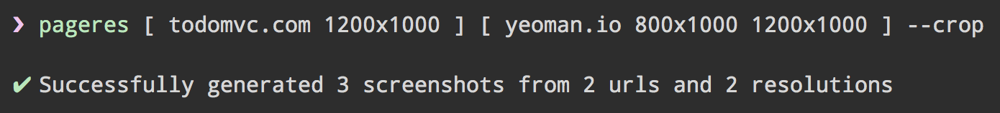
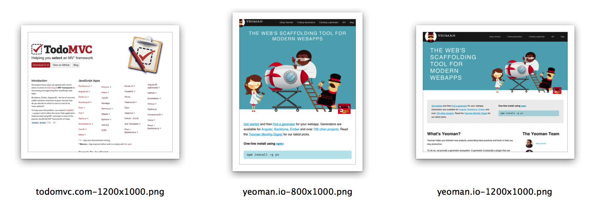

# pageres-cli





Capture screenshots of websites in various resolutions. A good way to make sure your websites are responsive. It's speedy and generates 100 screenshots from 10 different websites in just over a minute. It can also be used to render SVG images.

*See [pageres](https://github.com/sindresorhus/pageres) for the programmatic API and issues tracker.*

## Install

```
$ npm install --global pageres-cli
```

Note to Linux users: If you get a "No usable sandbox!" error, you need to enable [system sandboxing](https://github.com/GoogleChrome/puppeteer/blob/master/docs/troubleshooting.md#setting-up-chrome-linux-sandbox).

## Usage

Specify urls and screen resolutions as arguments. Order doesn't matter.

If no resolution is specified it will default to `1366x768` which is the most popular resolution.

```sh
pageres <url> <resolution>
pageres <resolution> <url>

# <url> can also be a local file path.
pageres <file> <resolution>
```

List multiple urls and resolutions for pageres to capture all combinations.

```sh
pageres <url> <resolution> ...

pageres https://sindresorhus.com 1024x768 1366x768 # 2 screenshots
pageres https://sindresorhus.com https://example.com 1024x768 # 2 screenshots
pageres https://sindresorhus.com https://example.com 1024x768 1366x768 # 4 screenshots
```

Group arguments with square brackets.

```sh
pageres [ <url> <resolution> ] [ <url> <resolution> ]
pageres [ <url> <resolution> ... ]

# Mix grouped and single arguments
pageres [ https://example.com 1024x768 1600x900 ] https://sindresorhus.com 1366x768

# Options defined inside a group will override the outer ones.
pageres [ https://example.com 1024x768 --no-crop ] https://sindresorhus.com 1366x768 --crop
```

Screenshots are saved in the current directory.

### Examples

```sh
# Basic multi-url, multi-resolution usage
pageres https://sindresorhus.com https://example.com 1366x768 1600x900

# Override outer option within group
pageres [ https://example.com 1366x768 1600x900 --no-crop ] [ https://sindresorhus.com 1024x768 480x320 ] --crop

# Provide a custom filename template
pageres https://sindresorhus.com 1024x768 --filename='<%= date %> - <%= url %>'

# Capture a specific element
pageres https://example.com 1366x768 --selector='.page-header'

# Hide a specific element
pageres https://example.com 1366x768 --hide='.page-header'

# Capture a local file
pageres unicorn.html 1366x768
```

### Options

##### `--verbose`, `-v`

Verbose output to see errors if you need to troubleshoot.

##### `--crop`, `-c`

Crop to the set height.

```
$ pageres https://sindresorhus.com 1024x768 --crop
```

##### `--delay=<number>`, `-d`

Delay screenshot capture.

```
$ pageres https://sindresorhus.com 1024x768 --delay=3
```

##### `--filename=<template>`

Custom filename.

```
$ pageres https://sindresorhus.com 1024x768 --filename='<%= date %> - <%= url %>'
```

##### `--overwrite`

Overwrite destination file if it exists. Defaults to appending ` (n)` to the file name if `--overwrite` is not set.

```
$ pageres https://sindresorhus.com 1366x768 --overwrite
```

##### `--selector=<element>`

Capture DOM element.

```
$ pageres https://example.com 1366x768 --selector='.page-header'
```

##### `--hide=<element>`

Hide DOM element. Can be set multiple times.

```
$ pageres https://example.com 1366x768 --hide='.page-header'
```

##### `--no-crop`

Override a global crop option within a group.

```
$ pageres [ https://example.com 1366x768 --no-crop ] https://sindresorhus.com 1024x768 --crop
```

##### `--css=<string>`

Apply custom CSS to the webpage. Specify some CSS or the path to a CSS file.

```
$ pageres https://sindresorhus.com --css='body { background: red; }'
$ pageres https://sindresorhus.com --css='style.css'
```

##### `--cookie=<cookie>`

Browser cookie. Can be set multiple times.

```
$ pageres https://example.com --cookie='foo=bar'
```

##### `--header=<header>`

Custom HTTP request header. Can be set multiple times.

```
$ pageres https://example.com --header='Cache-Control: no-cache'
```

##### `--username=<username>`

Username for HTTP auth.

##### `--password=<password>`

Password for HTTP auth.

##### `--scale=<number>`

Scale webpage `n` of times.

##### `--format=<string>`

Image format. Either `png` *(default)* or `jpg`.

##### `--user-agent=<string>`

Custom user agent.

##### `--transparent`

Set background color to `transparent` instead of `white` if no background is set.

##### `--darkMode`

Emulate preference of dark color scheme.

## Config file

You can persist your commands into a file and run it whenever with eg. `sh .pageres`:

```sh
# .pageres
pageres [ https://sindresorhus.com 1000x1000 --crop ] [ https://example.com 500x500 ]
pageres [ https://google.com 1000x1000 --crop ] [ https://github.com 500x500 ]
```

## Related

- [pageres](https://github.com/sindresorhus/pageres) - API for this module
- [capture-website-cli](https://github.com/sindresorhus/capture-website-cli) - A different take on screenshotting websites
